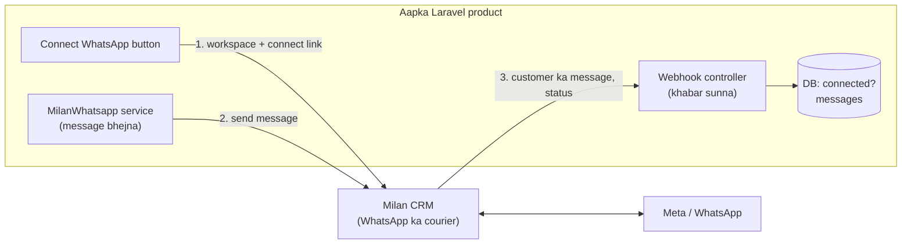

# Laravel Kit — apne multi-tenant product me Milan CRM ka WhatsApp lagana

Is folder ki files ko apne Laravel project me copy karne se aapke product me ye sab aa jata hai:

* har client (tenant) apna WhatsApp number **"Connect WhatsApp" button** se jod sakta hai,
* aap code se **message bhej** sakte hain (template / text / PDF / buttons),
* customer ka message aane par aapke code ko **khabar** milti hai (bot / inbox yahin banta hai),
* Meta / developer.facebook.com ka koi kaam aapke project me **nahi** hai.

> Ye kit test hui hai: 6 tests + ek "contract test" jisme Milan CRM ka asli webhook bhej kar is kit ke receiver se accept karwaya gaya.

---

## Ye sab kaise judta hai (simple)



| Aapke code me | Kab chalta hai | Kya karta hai |
|---|---|---|
| `WhatsappConnectController@connect` | Client "Connect WhatsApp" dabata hai | Workspace banata hai, client ko Milan CRM ke connect page par bhejta hai |
| `MilanWhatsapp` (service) | Jab aap message bhejna chahein | Milan CRM ko API call |
| `MilanWhatsappWebhookController` | Milan CRM jab bhi khabar de | Signature check, message DB me save, aapke bot ko event |

---

## Setup — 6 steps (15 minute)

### Step 1 — Milan CRM par key banwayein (ek baar)
Milan CRM wale server par ye command chalegi (ya jo CRM chalata hai wo chalaye):

```bash
php artisan gateway:client-create "Mera Product" --webhook-url=https://mera-product.com/api/hooks/whatsapp
```

Do cheezein milengi — **sirf ek baar** dikhti hain, copy kar lein: `API key (gw_...)` aur `Webhook secret (whsec_...)`.

### Step 2 — Files copy karein

| Kit me | Aapke project me |
|---|---|
| `app/Services/MilanWhatsapp.php`, `MilanWhatsappException.php` | `app/Services/` |
| `app/Models/TenantWhatsappAccount.php`, `WhatsappMessage.php` | `app/Models/` |
| `app/Events/WhatsappMessageReceived.php` | `app/Events/` |
| `app/Listeners/ExampleAutoReply.php` | `app/Listeners/` (ye sirf example hai) |
| `app/Http/Controllers/*.php` (2 files) | `app/Http/Controllers/` |
| `database/migrations/…create_milan_whatsapp_tables.php` | `database/migrations/` |
| `resources/views/whatsapp/settings.blade.php` | `resources/views/whatsapp/` |
| `tests/Feature/MilanWhatsappKitTest.php` | `tests/Feature/` |

### Step 3 — `.env` aur config
`config/services.snippet.php.txt` ke hisaab se `config/services.php` me `milan_wa` jodein, aur `.env` me:

```
MILAN_WA_URL=https://crm.aapka-milancrm-domain.com
MILAN_WA_KEY=gw_...
MILAN_WA_SECRET=whsec_...
```

### Step 4 — Migration
```bash
php artisan migrate
```

### Step 5 — Routes
`routes/snippets.php.txt` ke dono hisse paste karein:
* settings page ke routes → `routes/web.php` (login ke andar),
* webhook route → `routes/api.php` (**web.php me nahi** — wahan CSRF error aayega).

Webhook ka public URL `https://mera-product.com/api/hooks/whatsapp` hoga (wahi jo Step 1 me diya).

### Step 6 — Apne tenant ki pehchan
`WhatsappConnectController` me `tenantId()` aur `tenantName()` ko apne app ke hisaab se badlein
(jaise `$request->user()->tenant_id`, ya stancl/tenancy ka `tenant('id')`).

**Bas.** `/settings/whatsapp` kholein → "Connect WhatsApp" → Facebook login → number chunein → wapas aate hi "Connected".

---

## Roz ke kaam ka code

### Message bhejna

```php
use App\Services\MilanWhatsapp;

$wa = app(MilanWhatsapp::class);
$tenantId = $tenant->id;     // wahi id jo workspace banate waqt di

// Template — kabhi bhi (naye customer ko pehla message sirf template se jata hai)
$wa->sendTemplate($tenantId, '919876543210', 'order_update', ['Asha', 'ORD-5'], 'en', 'order-5-shipped');

// Text — sirf tab jab customer ne pichhle 24 ghante me aapko likha ho
$wa->sendText($tenantId, '919876543210', 'Aapka order nikal gaya hai.');

// PDF / image
$wa->sendMedia($tenantId, '919876543210', 'document', 'https://files.example.com/invoice.pdf', 'Aapka invoice', 'invoice.pdf');

// Buttons
$wa->sendButtons($tenantId, '919876543210', 'Confirm karein?', [['id' => 'yes', 'title' => 'Haan'], ['id' => 'no', 'title' => 'Nahi']]);
```

Aakhri argument (`'order-5-shipped'`) aapki apni unique key hai — same key se dobara call hui to message **dobara nahi jata**.

Errors pakadna:

```php
use App\Services\MilanWhatsappException;

try {
    $wa->sendText($tenantId, $phone, 'Hi');
} catch (MilanWhatsappException $e) {
    if ($e->isNotConnected())   { /* client ne WhatsApp connect nahi kiya */ }
    if ($e->isOutsideWindow())  { /* 24 ghante nikal gaye — template bhejein */ }
    report($e);
}
```

### Customer ka message aaya — bot / inbox

Jab bhi koi customer kisi tenant ke number par likhta hai, `WhatsappMessageReceived` event fire hota hai (message pehle se DB me save ho chuka hota hai):

```php
class MyBot
{
    public function handle(\App\Events\WhatsappMessageReceived $event): void
    {
        $m = $event->message;           // ->phone, ->text, ->type, ->content
        // ... aapka logic ...
        app(\App\Services\MilanWhatsapp::class)->sendText($event->tenantId, $m->phone, 'Namaste!', 'reply-' . $m->gateway_id);
    }
}
```

`ExampleAutoReply.php` ek chhota example hai (price / help par jawab). Apna listener bana kar yahi pattern use karein.

### Templates (client ke liye welcome / order update waghera)

```php
$wa->createTemplate($tenantId, 'order_update', 'UTILITY', [[
    'type' => 'BODY', 'text' => 'Hi {{1}}, aapka order {{2}} ship ho gaya.',
    'example' => ['body_text' => [['Asha', 'ORD-1']]],
]]);
$wa->templates($tenantId, ['status' => 'approved']);
```

Meta template ko review karta hai (kuch minute se kuch ghante). Approve / reject hone par `template.status` event aata hai
(`MilanWhatsappWebhookController` me Log ho jata hai — wahan apna code lagayein).

---

## Production checklist

- [ ] `MILAN_WA_KEY` / `MILAN_WA_SECRET` sirf `.env` me (git me nahi).
- [ ] Webhook URL public **https** par hai aur `routes/api.php` me hai.
- [ ] Queue worker chalta hai (agar listener `ShouldQueue` hai).
- [ ] `php artisan test` me kit ke tests green.
- [ ] Har client ko bata dein: WhatsApp ke conversation charges unke apne Meta account par lagte hain (payment method wahan jodna padta hai).
- [ ] Jo number abhi phone wali **WhatsApp Business App** me chal raha hai, uska connect Meta ki eligibility par hai — pehle naya number se test karein.

## Dikkat aaye to

| Problem | Wajah |
|---|---|
| Webhook par `401 Bad signature` | `MILAN_WA_SECRET` galat, ya Step 1 ka secret nahi daala. Secret rotate hua ho to naya daalein |
| Webhook aata hi nahi | URL public nahi / `routes/api.php` me nahi / Milan CRM ka scheduler band (retry nahi chalta) |
| `409 not_connected` | Tenant ne abhi WhatsApp connect nahi kiya |
| `422 ... 131047` | 24 ghante ki window band — `sendTemplate` use karein |
| Connect page "link expired" | 30 minute se purana link — "Connect WhatsApp" dobara dabayein |

Poora API reference: [../api-reference.md](../api-reference.md) · Setup guide (diagrams ke saath): [../developer-guide.md](../developer-guide.md)
